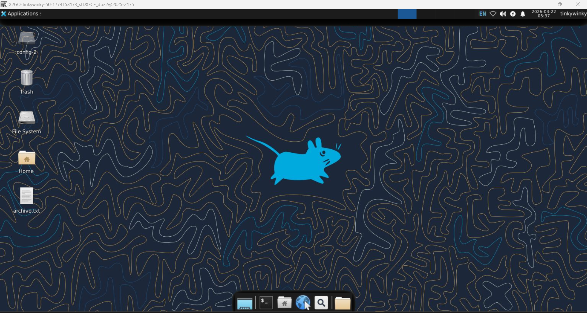

🇬🇧 **English** | 🇪🇸 [Español](README.md)

# 🛡️ Secure Remote Access Lab: Hardened Linux Server with X2Go


---

## Quick Demo

Secure SSH access (key-based authentication)  
Remote desktop via X2Go (XFCE)  
Hardened Linux server  
Firewall (UFW) + Intrusion prevention (Fail2Ban)  

---

## 📖 Overview

This project documents the deployment of a Linux cloud server (DigitalOcean) with remote graphical access using X2Go, applying **security hardening from the start**.

The main focus was not just installing services, but building a **functional, secure, and hardened remote system**, simulating a real-world environment.

---

## Project Objectives

- Deploy an Ubuntu server in the cloud  
- Configure secure remote access (SSH + X2Go)  
- Implement a lightweight desktop environment (XFCE)  
- Apply security hardening  
- Document real issues and solutions  

---

## Skills Demonstrated

- Linux system administration  
- Secure remote access (SSH)  
- Firewall management (UFW)  
- Intrusion prevention (Fail2Ban)  
- Cloud infrastructure handling  
- Real-world troubleshooting  

---

## System Architecture
```
[ Client (PC) ]
↓
Internet
↓
[ UFW Firewall ]
↓
[ SSH Server (2222) ]
↓
[ X2Go Server (22) ]
↓
[ XFCE Desktop ]
```

---

## 🖥️ Evidence

### 🔹 X2Go Connection


### 🔹 Remote Desktop


---

## Security Hardening (Summary)

- Root login disabled  
- SSH key-based authentication  
- Custom SSH port (2222)  
- UFW firewall configured  
- Brute-force protection with Fail2Ban  

Full configuration available in `/docs`

---

## Troubleshooting (Summary)

| Issue | Solution |
|------|--------|
| Black screen in X2Go | Configure `.xsession` with `startxfce4` |
| SSH denied | Properly configure SSH keys |
| Fail2Ban not blocking | Adjust ports in `jail.local` |

Full guide in `/docs/troubleshooting.md`

---

## 📂 Project Structure
```
hardened-x2go-remote-desktop/
├── README.md
├── README-EN.md
├── scripts/
├── configs/
├── screenshots/
└── docs/
```

---

## Conclusion

This project demonstrates that deploying cloud services requires more than installation—it requires applying security controls from the beginning.

Real-world hardening practices were implemented to reduce the attack surface and improve system resilience.

---

## Future Improvements

- Automation with Bash / Ansible  
- SIEM integration  
- VPN implementation  
- System monitoring  

---

## 👨‍💻 Author

**Fred Castillo**  
**Information Security Student**  
*Aspiring Red Team | Offensive Security*

[](https://www.linkedin.com/in/fredcastillo11/)
[](https://github.com/fredcastillo)
