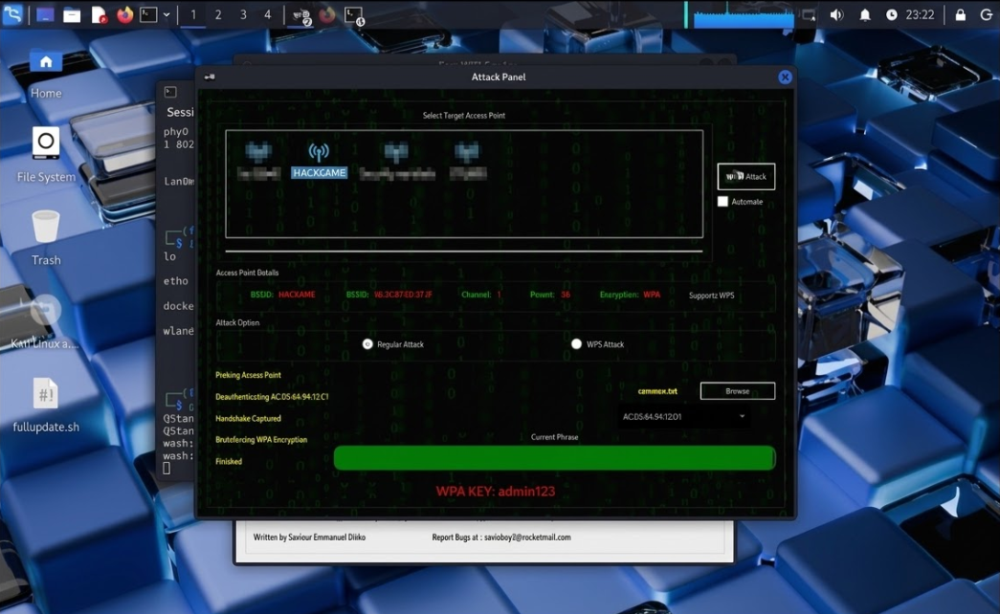

🇬🇧 **English** | 🇪🇸 [Español](README.md)

# 📡 WPA2 Handshake Capture – Wireless Security Lab


---

## 📖 Overview

This lab demonstrates how a **WPA2 handshake can be captured from a wireless network** and then used to perform a **dictionary attack** in order to recover the network password.

The experiment was conducted in a **controlled lab environment**, using a wireless network specifically created for cybersecurity testing.

The objective of this lab is to understand:

- How WPA2 authentication works
- How the handshake is captured
- How dictionary attacks operate
- The importance of strong passwords in WiFi networks

---

## ⚠️ Ethical Notice

This project was conducted **strictly for educational purposes** in a controlled lab environment.

All tests were performed on a **personal network created specifically for experimentation**.

These techniques must only be used on systems or networks **you own or have explicit authorization to test**.

Unauthorized access to wireless networks may be illegal and could result in **serious legal consequences**.

---

## 🧠 Attack Flow

```
Client connects to Access Point
          ↓
WPA2 Handshake generated
          ↓
Attacker captures handshake
          ↓
Dictionary attack is performed
          ↓
Password is recovered
```

---

## 🧪 Lab Environment

### Operating System
Kali Linux

### Wireless Adapter

Chipset: Qualcomm Atheros AR9271  
Driver: ath9k_htc  

Capabilities:

- Monitor Mode
- Packet Injection

---

## 🎯 Target Network

SSID: HACKEAME  
Encryption: WPA2-PSK  
Password: admin123  

---

## 🛠 Tools Used

- Aircrack-ng
- Airodump-ng
- Aireplay-ng
- Fern Wifi Cracker
- iwconfig

---

## ⚡ Methodology

### 1 — Check wireless interface

```bash
iwconfig
```

---

### 2 — Verify compatibility

```bash
sudo airmon-ng
```

---

### 3 — Kill interfering processes

```bash
sudo airmon-ng check kill
```

---

### 4 — Enable monitor mode

```bash
sudo airmon-ng start wlan0
```

Created interface:

```
wlan0mon
```

---

### 5 — Scan networks

```bash
sudo airodump-ng wlan0mon
```

Important field:

```
ENC → WPA2
```

---

### 6 — Test packet injection

```bash
sudo aireplay-ng --test wlan0mon
```

---

### 7 — Launch Fern Wifi Cracker

```bash
sudo fern-wifi-cracker
```

---

## 📸 Screenshots

### 🔍 Network Scan


---

### ⚡ Attack Process


---

### 🔑 Password Recovered



---

## 🎥 Lab Demonstration Video

<p align="center">
  <a href="https://www.youtube.com/watch?v=WMOPhl1d1MY">
    
  </a>
</p>

<p align="center">
  <b>Full demonstration of the WPA2 handshake attack</b>
</p>

---

## ✅ Result

The dictionary attack successfully recovered the password:

```
admin123
```

This confirms that:

- The handshake was successfully captured
- The password existed in the dictionary used

---

## 🔐 How to Protect Against This Attack

To prevent this type of attack:

- Use strong passwords (12+ characters)
- Avoid dictionary-based passwords
- Disable WPS on your router
- Use WPA3 if available
- Regularly monitor connected devices

---

## 📚 Lessons Learned

- WPA2 security heavily depends on password strength
- Weak passwords are vulnerable to dictionary attacks
- Capturing the handshake does not reveal the password directly
- Attacks are performed offline after capture

---

## 🧠 Skills Demonstrated

Wireless Security Testing  
WPA/WPA2 Authentication Analysis  
Linux Networking Tools  
Packet Injection Testing  
Dictionary Attack Methodology  

---

## 👨‍💻 Author

**Fred Castillo**  
*Information Security Technology Student*  
*Red Team Aspirant | Offensive Security*

[](https://www.linkedin.com/in/fredcastillo11/)
[](https://github.com/fredcastillo)
