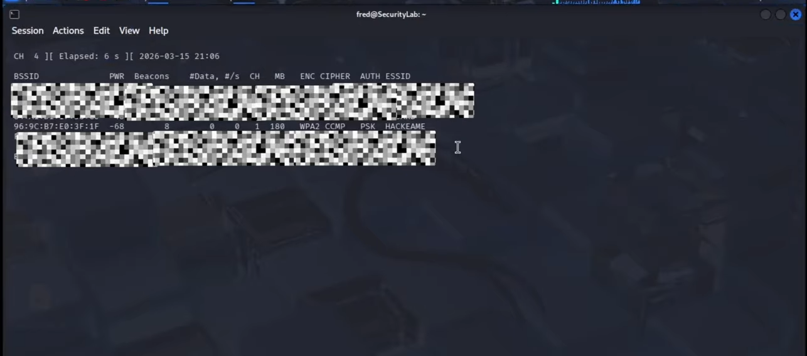
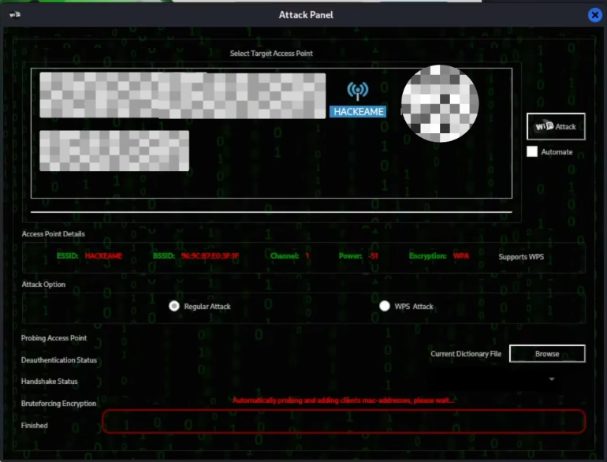

🇪🇸 **Español** | 🇬🇧 [English](README-EN.md)

# 📡 Captura de Handshake WPA2 – Laboratorio de Seguridad Inalámbrica


---

## 📖 Descripción

Este laboratorio demuestra cómo se puede **capturar el handshake WPA2 de una red inalámbrica** y posteriormente utilizarlo para realizar un **ataque de diccionario** con el objetivo de recuperar la contraseña de la red.

El experimento fue realizado en un **entorno de laboratorio controlado**, utilizando una red inalámbrica creada específicamente para prácticas de ciberseguridad.

El objetivo de este laboratorio es comprender:

- Cómo funciona la autenticación WPA2
- Cómo se captura el handshake de autenticación
- Cómo funcionan los ataques de diccionario
- La importancia de usar contraseñas fuertes en redes WiFi

---

## ⚠️ Aviso Ético

Este proyecto fue realizado **exclusivamente con fines educativos** en un entorno de laboratorio controlado.

Todas las pruebas se realizaron sobre **una red personal creada para experimentación**.

Estas técnicas deben utilizarse **únicamente en redes propias o en aquellas donde exista autorización explícita para realizar pruebas de seguridad**.

El acceso no autorizado a redes inalámbricas puede ser ilegal y podría tener **consecuencias legales graves**.

---

## 🧠 Flujo del Ataque

```
Cliente se conecta al Access Point
          ↓
Se genera el WPA2 Handshake
          ↓
El atacante captura el handshake
          ↓
Se ejecuta ataque de diccionario
          ↓
Se descubre la contraseña
```

---

## 🧪 Entorno del Laboratorio

### Sistema Operativo
Kali Linux

### Adaptador Inalámbrico

Chipset: Qualcomm Atheros AR9271  
Driver: ath9k_htc  

Capacidades:

- Monitor Mode
- Packet Injection

---

## 🎯 Red Objetivo

SSID: HACKEAME  
Cifrado: WPA2-PSK  
Contraseña: admin123  

---

## 🛠 Herramientas Utilizadas

- Aircrack-ng
- Airodump-ng
- Aireplay-ng
- Fern Wifi Cracker
- iwconfig

---

## ⚡ Metodología del Ataque

### 1 — Verificar el adaptador inalámbrico

```bash
iwconfig
```

---

### 2 — Verificar compatibilidad

```bash
sudo airmon-ng
```

---

### 3 — Detener procesos que interfieren

```bash
sudo airmon-ng check kill
```

---

### 4 — Activar modo monitor

```bash
sudo airmon-ng start wlan0
```

Interfaz creada:

```
wlan0mon
```

---

### 5 — Escanear redes inalámbricas

```bash
sudo airodump-ng wlan0mon
```

Campo importante:

```
ENC → WPA2
```

---

### 6 — Probar inyección de paquetes

```bash
sudo aireplay-ng --test wlan0mon
```

---

### 7 — Ejecutar Fern Wifi Cracker

```bash
sudo fern-wifi-cracker
```

---

## 📸 Capturas de Pantalla

### 🔍 Escaneo de Red



---

### ⚡ Proceso de Ataque



---

### 🔑 Contraseña Recuperada


---

## 🎥 Video del Laboratorio

<p align="center">
  <a href="https://www.youtube.com/watch?v=WMOPhl1d1MY">
    
  </a>
</p>

<p align="center">
  <b>Demostración completa del ataque WPA2 Handshake</b>
</p>

---

## Resultado

✅ El ataque de diccionario logró recuperar la contraseña:

```
admin123
```

Esto confirma que:

- El handshake fue capturado correctamente
- La contraseña estaba incluida en el diccionario utilizado

---

## 🔐 Cómo Protegerse de Este Ataque

Para evitar este tipo de ataques en redes reales:

- Usar contraseñas largas (12+ caracteres)
- Evitar contraseñas comunes o de diccionario
- Desactivar WPS en el router
- Utilizar WPA3 si está disponible
- Monitorear dispositivos conectados regularmente

---

## 📚 Lecciones Aprendidas

- La seguridad WPA2 depende en gran medida de la fortaleza de la contraseña
- Contraseñas débiles son vulnerables a ataques de diccionario
- Capturar el handshake no revela la contraseña directamente
- Los ataques se realizan de forma offline

---

## 🧠 Habilidades Demostradas

Pruebas de Seguridad Inalámbrica  
Análisis de Autenticación WPA/WPA2  
Uso de Herramientas de Red en Linux  
Pruebas de Inyección de Paquetes  
Metodología de Ataques de Diccionario  

---

## 👨‍💻 Autor

**Fred Castillo**  
*Estudiante de Tecnólogo en Seguridad Informática*  
*Aspirante a Red Team | Seguridad Ofensiva*

[](https://www.linkedin.com/in/fredcastillo11/)
[](https://github.com/fredcastillo)
